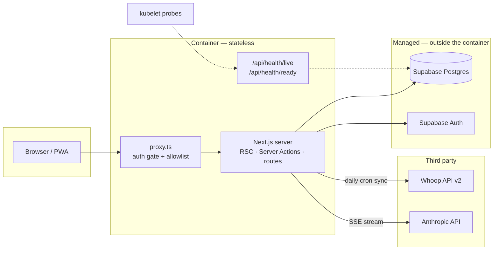
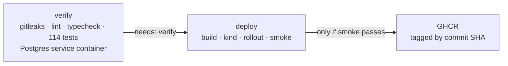

# Health OS

Personal health tracker. Pulls biometrics from [Whoop](https://www.whoop.com/)
and combines them with manually tracked strength training, basketball,
supplements and daily check-ins, then lets a Claude-powered coach reason over
the lot. Single user, installable as a PWA.

**Next.js 16 · TypeScript · Supabase Postgres · Drizzle ORM · Anthropic SDK**

It runs on Vercel. It also builds into a container, ships with a real test
suite, and deploys to Kubernetes from CI — that side of the repo exists to make
the deployment path explicit and reviewable, not because one user needs it.
Every decision behind it is written down in
[`docs/DECISIONS.md`](docs/DECISIONS.md) (28 ADRs), including the ones that
turned out to be wrong.

---

## Architecture



Everything stateful sits outside the container: the database, the identity
provider, and both third-party APIs. That is what lets a replica be killed
mid-flight and replaced without coordination — the precondition for rolling
updates and liveness restarts meaning anything.

**Data flows one way.** A daily cron pulls from Whoop into Postgres; the UI only
ever reads from Postgres. Nothing fetches Whoop on page load.

---

## Run it

### Locally, against your own Supabase project

```bash
pnpm install
cp .env.example .env.local        # every variable is documented there
pnpm db:migrate                   # apply the schema
pnpm dev                          # http://localhost:3000
```

### In a container

```bash
docker compose --env-file .env.local up --build
```

`--env-file` is required: Compose interpolates `${VAR}` from `.env` by default,
and this repo keeps its variables in `.env.local`.

The stack also starts a local `postgres:17` — used for migrations and the
integration tests, **not** by the app, which talks to hosted Supabase. Running
the app against a local database while its Auth lived remotely would split
identity and data across two databases.

### On Kubernetes

```bash
kind create cluster --config k8s/kind-cluster.yaml

kubectl apply -f https://raw.githubusercontent.com/kubernetes/ingress-nginx/controller-v1.11.3/deploy/static/provider/kind/deploy.yaml
kubectl -n ingress-nginx wait --for=condition=Ready pod \
  --selector=app.kubernetes.io/component=controller --timeout=240s

docker build -t healthos-app:dev \
  --build-arg NEXT_PUBLIC_SUPABASE_URL=... \
  --build-arg NEXT_PUBLIC_SUPABASE_ANON_KEY=... .
kind load docker-image healthos-app:dev --name healthos

kubectl apply -f k8s/namespace.yaml -f k8s/configmap.yaml
kubectl -n healthos create secret generic healthos-secrets --from-env-file=.env.local
kubectl apply -f k8s/deployment.yaml -f k8s/service.yaml -f k8s/ingress.yaml
```

Then `http://localhost`. Manifests are hand-written, no Helm — every line is
meant to be readable. `k8s/secret.example.yaml` is a template and is never
applied; the real Secret is built from the gitignored `.env.local`.

---

## Secrets

No credential is committed, and two gates keep it that way.

```bash
git config core.hooksPath .githooks   # once per clone
```

That enables a pre-commit hook that runs `gitleaks` against the staged changes
and refuses the commit on a finding. CI runs the same scan across the **entire
history** as the first step of every run, before anything is installed or
built — because a hook can be bypassed with `--no-verify` and is not installed
on a fresh clone.

Known placeholders are allowlisted individually in `.gitleaks.toml`, by exact
string rather than by file, so a real secret pasted into the same test fixture
still fails the scan.

Real values never live in the repository:

| | Where the value comes from |
| --- | --- |
| Local development | `.env.local`, gitignored |
| Kubernetes | `kubectl create secret --from-env-file=.env.local`. `k8s/secret.example.yaml` is a committed template with placeholders and is never applied. |
| CI | Placeholders for everything except the two public `NEXT_PUBLIC_*` values, which come from repository variables |
| Production | Vercel environment variables |

A Kubernetes Secret is base64, not encryption — anyone who can read the object
reads the credential. On a real cluster the values would come from External
Secrets Operator, Sealed Secrets, or SOPS, so that Git holds a reference and
never a value. `k8s/secret.example.yaml` documents all three and why.

## Tests

```bash
pnpm test              # everything, ~8s
pnpm test:unit         # pure logic and mocked boundaries, ~1.5s
pnpm test:integration  # against a real Postgres, ~5s
```

114 tests. The integration suite needs `docker compose up -d postgres` first,
and **builds its schema by replaying the real migration chain**, not with
`drizzle-kit push`. That is deliberate: production's schema comes from those
files, so the tests must run against the same DDL. It also means every run
re-verifies that the migrations replay from empty — the check whose absence let
a broken migration survive five months.

`TEST_DATABASE_URL` is a separate variable from `DATABASE_URL`, and the suite
refuses to run against a non-local host. It truncates every table between tests.

---

## Deploys



`needs: verify` is a scheduling dependency, not a condition — a failing test
means the deploy job is never scheduled, rather than started and failed.

The deploy job builds the image, stands up a single-node kind cluster, applies
the same manifests as above, waits for the rollout, and smoke tests four paths
through the Ingress. Only then is the image pushed, so the registry holds
images that have demonstrably served traffic. Images are tagged by commit SHA;
`:latest` would make rollback impossible, since there would be no previous
image to name.

Rollback is `kubectl -n healthos rollout undo deploy/healthos`.

---

## Repo map

| Path | |
| --- | --- |
| `app/` | Routes, pages, Server Actions. Server Components by default. |
| `lib/db/` | Drizzle schema, migrations, queries grouped by domain. |
| `lib/whoop/` | API client, OAuth, payload → row mappers. |
| `lib/anthropic/` | Coach, weekly review, context builder. |
| `lib/observability/` | Structured logger, Prometheus metrics, metrics server. |
| `k8s/` | Hand-written manifests. `k8s/ci/` is CI-only, `k8s/observability/` is Prometheus, Grafana and Alertmanager. |
| `docs/DECISIONS.md` | 28 ADRs — the reasoning, including corrections. |
| `docs/PRD.md` | Product spec. |

---

## Scripts

| Command | Purpose |
| --- | --- |
| `pnpm dev` | Dev server |
| `pnpm build` | Production build (`--webpack`, required by Serwist) |
| `pnpm test` | Full suite |
| `pnpm test:unit` / `test:integration` | One suite only |
| `pnpm typecheck` | `tsc --noEmit` |
| `pnpm lint` | ESLint |
| `pnpm db:generate` | Generate a migration from schema changes |
| `pnpm db:migrate` | Apply pending migrations |
| `pnpm db:studio` | Drizzle Studio |
